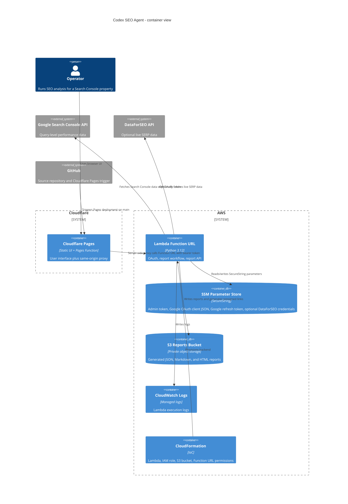

# Architecture

Codex SEO Agent is a low-volume SEO workflow runner. The public frontend is a Cloudflare Pages UI with a same-origin Pages Function proxy. The hosted backend is an AWS Lambda Function URL that runs a Google Search Console workflow, writes report artifacts to S3, and stores OAuth/admin secrets in SSM Parameter Store.

## Container Diagram

## Runtime Flow

1. The operator opens the Cloudflare Pages UI.
2. The operator enters a website or Search Console property.
3. `Connect Search Console` calls the same-origin Pages Function route `/api/connect`.
4. The Pages Function forwards to Lambda with the backend access key stored in Cloudflare Pages secrets.
5. Google redirects back to `/auth/google/callback`; Lambda stores the OAuth token JSON in SSM SecureString.
6. `Generate Plan` calls `/api/run` through the Pages Function proxy.
7. Lambda fetches Search Console data, identifies ranking gaps, optionally calls DataForSEO, creates a content plan, writes reports to S3, and returns summary JSON plus presigned report links.

## Deployment Shape

- Frontend: Cloudflare Pages, Git-integrated with the GitHub `main` branch.
- Frontend proxy: Cloudflare Pages Function in `functions/api/[[path]].js`.
- Backend: CloudFormation stack `codex-seo-agent-lambda`.
- Artifact packaging: `serverless/scripts/deploy-lambda.sh` builds a Lambda zip in `.local/`, uploads it to an artifact bucket, stores an admin token in SSM, and deploys CloudFormation.
- Reports: private S3 bucket created by CloudFormation.

## AWS Boundaries

- Lambda runs outside a VPC to avoid NAT Gateway cost and complexity.
- Lambda Function URL is public with app-level bearer-token authorization.
- Cloudflare Pages Function is the browser-facing API surface and injects the bearer token server-side.
- The IAM role is scoped to the reports bucket and named SSM parameters.
- S3 public access is blocked.

## Data Flow

- Search Console query data enters Lambda from Google APIs.
- Report JSON/Markdown/HTML is written to S3 under date-based prefixes.
- The frontend receives summary JSON and time-limited presigned links through the Pages Function proxy.
- Admin token and OAuth tokens are not committed to Git and are not exposed in browser JavaScript.

## Auth Flow

- App access uses a single backend bearer token stored in SSM and Cloudflare Pages secrets.
- Google Search Console access uses OAuth Web application flow.
- The OAuth callback URL is the Lambda Function URL path `/auth/google/callback`.

## CI/CD Flow

- GitHub `main` pushes trigger Cloudflare Pages for the static frontend.
- GitHub Actions validate Python syntax, shell syntax, Pages Function syntax, static HTML parsing, CloudFormation template presence, and whitespace.
- Lambda deployment is manual via `serverless/scripts/deploy-lambda.sh`; this is intentional to avoid accidental cloud changes from public repo pushes.

## Key Constraints

- The hosted backend is designed for one operator, not multi-tenant SaaS use.
- Lambda has a 15-minute timeout. Long-running SERP work would need async jobs or a container worker.
- DataForSEO is optional; without credentials, competitor analysis uses mock fallback data.
- There is no custom domain, WAF, or Cognito login yet.
